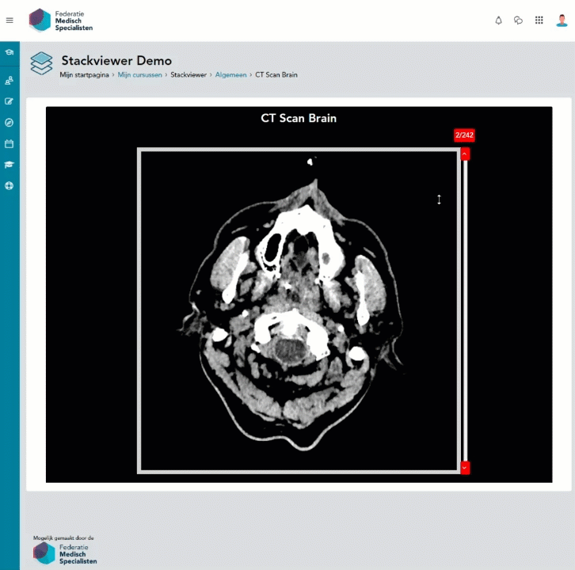

# Moodle - mod_stackview

Stackviewer is a course activity plugin which allows teachers to display images as a stack. The
student can scroll through the stack of images, similar to using radiological DICOM software to
research medical imagery. Its intended purpose is for medical education displaying Ultrasound, MRI
and CT radiology imagery for diagnostic purposes. But other educational applications can well be
imagined. The images in the stack are automatically numbered so that an educational dialogue can
be conducted regarding the presented images in the stack.
Stackviewer can be presented at any desired place in a course using Filter Embed Code. Accepted file
types are JPEG, PNG, SVG and GIF. Images will be presented in alphabetical order A-Z 1-9. There is no
limit to the number of images or to the file size. To improve performance, consider the student’s
available bandwidth and device screen size. Using a HD (High Definition) image size of 1280 pixels x
720 pixels as a maximum standard is recommended. Plugin translations available in English and
Dutch.
The development of Stackviewer was commissioned by the Association of Medical Specialists in The
Netherlands https://demedischspecialist.nl Now available to the community of medical teachers
around the world.



##### Features:

- GDPR null_provider
- Scrollable images based on https://kenwheeler.github.io/slick/ tweaked to allow scrolling.
- Images upload by separate capability.
- Order is based on image names.
- There is an additional filter (filter_stackview) that can be used for embedding.
- Manual embedding sample below.

```text
<iframe src="/mod/stackview/view.php?id=68&action=embedded" width="600" height="600" frameborder="0" webkitallowfullscreen mozallowfullscreen allowfullscreen></iframe>```
```

##### Tested in:


### Installation

1. Copy this plugin to the `mod\stackview` folder on the server
2. Login as administrator
3. Go to Site Administrator > Notification
4. Install the plugin
5. You will need to fill out the settings.

##### Requirements:

* Recommended Moodle version: **Moodle 4.3**
* Recommended PHP version: **8.0**
* Required Moodle version: **Moodle 4.3**
* Required PHP version: **8.0**
---
### Changelog

##### 4.3.0 (14.10.2024)
- Update to show embedcode for tenant admins.

##### 3.9.6 (24.08.2022)
- Update code style to trigger less errors.

##### 3.9.3 (24.08.2022)
* Solved dutch text in english lang file. #2
* Solved `slick.js` missing from thirdpartylilbs.xml #1

##### 3.9.2 (15.05.2022)
* Remove unnecessary files
* Don't load dependencies from other places

##### 3.9.1 (26.07.2021)
* Add navigation buttons and allow touch events.

##### 3.9 (09.05.2021)
* Original release 

---
### Security Vulnerabilities
If you discover any security vulnerabilities, please send an e-mail to Avetica via [l.verhoeven@avetica.nl](l.verhoeven@avetica.nl)

---
### License

This project is licensed under the **GNU General Public License v3.0**. - http://www.gnu.org/licenses or see
the [LICENSE](LICENSE) file.

---
### Copyright


Copyright © 2021 Avetica :: [avetica.nl](https://avetica.nl/)

##### Author:
* Luuk Verhoeven :: [Ldesign Media](https://ldesignmedia.nl/) - [luuk@ldesignmedia.nl](luuk@ldesignmedia.nl)


